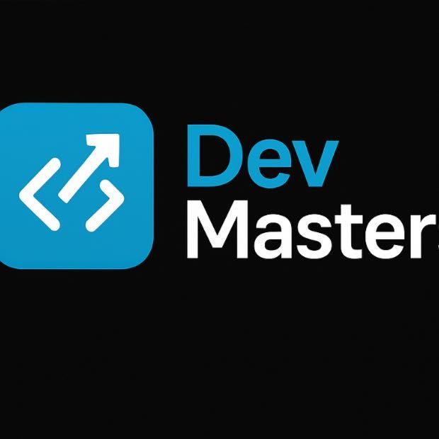

# ABP – Aprendizagem Baseada em Projetos  

<p align="center">  
    
</p>  

<p align="center">  
  <a href="#-descrição-do-projeto">Sobre o Projeto</a> |  
  <a href="#-entregas-de-sprints">Entrega de Sprints</a> |  
  <a href="#-documentação">Documentação</a> |  
  <a href="#-protótipo-no-figma">Protótipo</a> |  
  <a href="#equipe">Nossa Equipe</a>  
</p>  

---
# Main repository  

Este repositório tem como objetivo documentar e centralizar as informações principais do projeto **ABP 2026 - 1º semestre**.

O projeto está dividido em dois repositórios principais: um para o **backend** e outro para o **frontend**.

## Repositórios do projeto  

### Backend  

Repositório responsável pela API, regras de negócio, banco de dados, autenticação e demais serviços do sistema.

[backend_abp_autoatendimento](https://github.com/devmaster-organizations/backend_abp_autoatendimento)

### Frontend  

Repositório responsável pela interface web da aplicação, telas, componentes visuais e integração com a API.

[frontend_abp_autoatentimento](https://github.com/devmaster-organizations/frontend_abp_autoatentimento)

## Estrutura geral  

```txt
MainABP2026
├── Backend  -> API e regras de negócio
└── Frontend -> Interface web da aplicação
```
--- 

## 📌 Descrição do projeto  

Este projeto está sendo desenvolvido como atividade do **2º semestre do curso de Desenvolvimento de Software Multiplataforma da Fatec Jacareí**.  

O projeto, intitulado "Aplicação Web para Autoatendimento da Secretaria Académica da Fatec Jacareí", consiste no desenvolvimento de uma aplicação baseada num chatbot conversacional para mitigar a sobrecarga operacional da secretaria.  

---

## 🎯 Objetivo do sistema:

O objetivo central do sistema é desenvolver uma aplicação web de autoatendimento para a Secretaria Académica da Fatec Jacareí, utilizando um modelo de chatbot conversacional.  

Os propósitos específicos desta solução incluem:  

- **Redução da sobrecarga operacional:** Mitigar o volume de dúvidas recorrentes que geram atrasos e inconsistências no atendimento da secretaria, especialmente em períodos críticos como rematrículas e exames.  

- **Guia estruturado ao utilizador:** Conduzir os alunos e interessados externos através de uma árvore de navegação com menus e perguntas guiadas, além de permitir consultas diretas.  

- **Padronização da informação:** Fornecer respostas objetivas e verificáveis, baseadas em documentos oficiais (como o Regulamento Geral das Fatecs e Calendário Académico), garantindo a confiabilidade e a rastreabilidade dos dados.  

- **Apoio documental:** Apresentar, quando aplicável, trechos de evidências extraídos diretamente das normas vigentes da instituição.  

- **Intermediação de dúvidas complexas:** Permitir que, caso a dúvida não seja resolvida pela navegação, o utilizador envie a pergunta diretamente à secretaria através do sistema.  

---
## 📅 Entregas de Sprints  
As entregas seguem o cronograma definido com o cliente. Cada sprint gera um relatório e backlog detalhado.  

<div align="center">  

| Sprint | Entrega       | Status | Relatório |  
|------: |---------------|:------:|:------------------------------------------:|  
| 1      | 📅 04/05/2026 | ✅      | [Ver Backlog](./documentacao/sprints/sprint_1.md) |  
| 2      | 📅 25/05/2026 | 🚧    | [Ver Backlog](./documentacao/sprints/sprint_2.md) |  
| 3      | 📅 --/--/---- | `—`    | [Ver Backlog](./documentacao/sprints/sprint_3.md) |  

</div>  

**Legenda:**  
- ✅ **Finalizada**  
- 🚧 **Em Progresso**  
- `—` **Não iniciado**  

---  

## 📑 Documentação  

- **Backlog do Produto:** [Acesse aqui](./documents/product_backlog-v2.md)  
  Lista de requisitos funcionais e não funcionais, organizados em **User Stories**, conforme o desafio da Secretaria Acadêmica.   
  
- **Backlog do Produto - mapa:** [Acesse aqui](./documents/product_backlop_map.md)  

- **Modelagem do Banco de Dados:** [Acesse aqui](./documents/modelagem_bd.md)  
  Estrutura de entidades e relacionamentos para suportar navegação, perguntas e respostas.  
  
- **Definition of Ready (DoR):** [Acesse aqui](./documentacao/Definition-of-Ready-NexaTech.md)  
  Critérios que definem quando uma *user story* está pronta para entrar em sprint.  
  
- **Definition of Done (DoD):** [Acesse aqui](./documentacao/Definition-of-Done-NexaTech.md)  
  Critérios que garantem qualidade e conclusão das tarefas.  
  
- **Diagramas UML:** [Acesse aqui](./documentacao/UML/)  
  Casos de uso, classes, sequência e componentes, representando o fluxo do chatbot e gestão de conteúdo.  
  
---

## 📍 Focal Point  
- Focal Point: Prof. André Olímpio  
- Kick-off: 27/03/2026  


## 👨‍💻Equipe 

| Nome | Função | GitHub |Portfólio|
|------|--------|--------|--------|
| Victor Ramos | Scrum Master | [Github](https://github.com/victorramos887/victorramos887) | [Portfólio](https://fatec-jacarei-dsm-portfolio.github.io/ra2581392523037/) |
| Ricardo Ladeira | Product Owner | [Github](https://github.com/rladeiraFatec) | [Portfólio](https://fatec-jacarei-dsm-portfolio.github.io/ra2581392523010) |
| Caio Julião | Desenvolvedor | [Github](https://github.com/caiao93guitar) | [Portfólio](https://fatec-jacarei-dsm-portfolio.github.io/ra2581392523008 ) |
| Jocelio Gomes Silva | Desenvolvedor | [Github](https://github.com/Git-Jocelio) | [Portfólio](https://fatec-jacarei-dsm-portfolio.github.io/ra2581392523040) | 
| Lucas dos Santos Ribeiro | Desenvolvedor | [Github](https://github.com/LucassantosR25) | [Portfólio](https://fatec-jacarei-dsm-portfolio.github.io/ra2581392523004/) |
| Luis Gustavo | Desenvolvedor | [Github](https://github.com/LuisGustavo9) | [Portfólio](https://fatec-jacarei-dsm-portfolio.github.io/ra2581392523041) |


